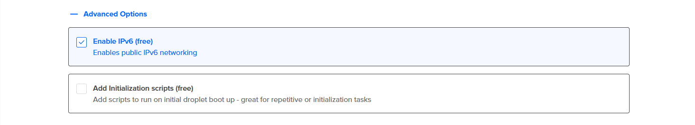
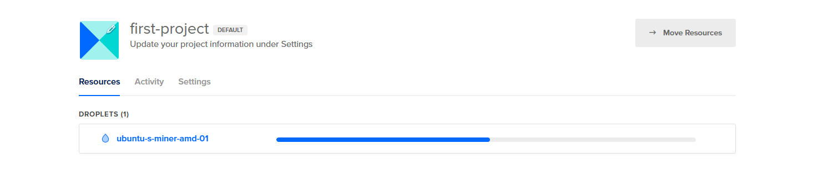

# Guide for Mining the HIP Subnet on DigitalOcean

This guide will walk you through setting up a miner on the HIP Subnet using a DigitalOcean droplet. DigitalOcean provides you with $200 credit for 2 months apon signing up with this affiliate link (big button bellow). This should give you pleanty of time to mine the HIP-Subnet at no cost.

[](https://www.digitalocean.com/?refcode=d7760ce3c1d6&utm_campaign=Referral_Invite&utm_medium=Referral_Program&utm_source=badge)

Once you have made an account with the provided link (big button above) or logged into your existing account, Follow these steps to get started mining on the HIP-Subnet:

## Droplet Setup

### Step 1: Choose a Region

1. Select the datacenter closest to your location to minimize latency and improve performance.


### Step 2: Choose an Image

1. Select **Ubuntu Server 24.04 (LTS)** as your operating system.


### Step 3: Choose Droplet Size and CPU Options

1. Select a droplet instance that meets the minimum requirements (I recommend the premium AMD under the basic plan as it is (at the time of writing) the cheapest option to meet  the minimum requirements):
   - **2X VCPU**
   - **8GB RAM**
   - **100GB SSD**


### Step 4: Choose Authentication and Advanced Options

1. Select **SSH Key** for secure authentication.
   - If you haven't added an SSH key, follow the [DigitalOcean guide](https://docs.digitalocean.com/products/droplets/how-to/add-ssh-keys/) to add one.
2. Enable **IPv6** to future-proof your setup.
3. Optionally, add any initialization scripts if required.




### Step 5: Finalize and Create Droplet

1. Provide a meaningful name for your droplet to easily identify it.
2. Assign relevant tags for better organization.
3. Click **Create Droplet** to initiate the setup process.


### Step 6: Wait for the Droplet to Launch

1. The creation process will take a few moments. Be patient while the droplet is being set up.



### Step 7: Droplet Creation Complete

1. Once the droplet is ready, you will see the status change to active.


## Setting Up the Firewall

### Step 8: Create Firewall and Configure Inbound Rules

1. Set up firewall rules to secure your droplet and allow your miner to recieve/transmit synapses to/from validators.
2. Select your droplet and navigate down the left hand side of the dashboard and select the **Networking** section and create a new firewall.
3. Allow **SSH** on port **22** to enable secure remote access.
4. Allow **All TCP** ports for application communication.
5. Allow **All UDP** ports for any additional services.


### Step 9: Configure Outbound Rules

1. Allow **All traffic** for ICMP, TCP, and UDP to ensure proper communication with the subnet.


## Droplet Initialization

Once the firewall is set up, you are now ready to initialize your droplet for mining.

### Step 10: SSH into Your Droplet

1. (SIMPLE) Select the console option on the right hand side of your droplets dashboard and use the provided terminal that will open in a new window.

2. (EXPERIENCED) Use your SSH key to securely log in to your droplet from your own bash terminal.


---

## In the Terminal

### Step 1: Clone the HIP Subnet Repository

1. Clone the HIP Subnet repository to your droplet and navigate into the cloned repo.

   ```bash
   git clone https://github.com/HIP-LABS/HIP-Subnet.git
   cd HIP-Subnet
   ```

### Step 2: Create a Virtual Environment and Install Dependencies

1. Update your package list.

   ```bash
   sudo apt-get update
   ```

2. Install the Python virtual environment package.

   ```bash
   sudo apt install python3.10-venv  # Use python3.12-venv if available
   ```

3. Create a virtual environment.

   ```bash
   python3 -m venv venv
   ```

4. Activate the virtual environment.

   ```bash
   source venv/bin/activate
   ```

5. Install the necessary Python packages.

   ```bash
   python3 -m pip install -e .
   ```

### Step 3: Set Up the Frontend

1. Allow execute permissions to the setup script.

   ```bash
   chmod +x scripts/setup_uvicorn_service.sh
   ```

2. Run the setup script to start the frontend service.

   ```bash
   ./scripts/setup_uvicorn_service.sh
   ```

The frontend should now be running as a background process, accessible from a browser on your local network including your mobile phone. (e.g., <http://your-droplet-ip:5001/index.html>).

### Step 4: Check Wallet Balance

*be sure to replace <YOUR_WALLET_KEYS> with your corresponding keys.*

1. Ensure your wallet has enough TAO for staking and registration.

   ```bash
   btcli w balance --wallet.name <YOUR_WALLET_COLDKEY> --wallet.hotkey <YOUR_WALLET_HOTKEY> --subtensor.network finney
   ```

### Step 5: Register Wallet to Subnet 36

1. Register your wallet.

   ```bash
   btcli subnet register --netuid 36 --wallet.name <YOUR_WALLET_COLDKEY> --wallet.hotkey <YOUR_WALLET_HOTKEY> --subtensor.network finney
   ```

2. Confirm registration.

   ```bash
   btcli w inspect --netuid 36 --wallet.name <YOUR_WALLET_COLDKEY> --wallet.hotkey <YOUR_WALLET_HOTKEY> --subtensor.network finney
   ```

### Step 6: Run the Miner Script

#### Using `tmux` to Run the Miner in the Background

`tmux` is a terminal multiplexer that allows you to run multiple terminal sessions within a single window or remote terminal session. This is useful for running long-term processes, like your miner, in the background.

1. Install `tmux` if it is not already installed:

   ```bash
   sudo apt-get install tmux
   ```

2. Create a new `tmux` session named `miner`:

   ```bash
   tmux new -s miner
   ```

3. Inside the `tmux` session, start the miner:

   ```bash
   python ./neurons/miner.py --netuid 36 --subtensor.network finney --wallet.name <YOUR_WALLET_COLDKEY> --wallet.hotkey <YOUR_WALLET_HOTKEY> --logging.debug --logging.trace
   ```

4. Detach from the `tmux` session while leaving the miner running by pressing:

   ```plaintext
   Ctrl+b, then d
   ```

#### Reattaching to the `tmux` Session

To check on the miner or interact with it again:

1. Reattach to the `tmux` session:

   ```bash
   tmux attach -t miner
   ```

2. Detach again by pressing:

   ```plaintext
   Ctrl+b, then d
   ```

### Step 7: Access the Frontend

1. Open your browser and navigate to:

   ```url
   http://your-droplet-ip:5001
   ```

   Replace `your-droplet-ip` with your actual droplet IP address.

2. You should now have access to the webapp and be recieving tasks ffrom validators to complete.

   

By following these steps, you should be able to set up and run a miner on the HIP Subnet from anywhere with your server ip you created. Enjoy mining!
